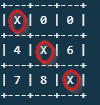
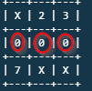
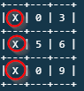
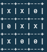

## Tic tac toe game [Collaborative Project]

The game has two players. Each Player should have a unique name. The game is a table that has values from one (1) to nine (9). The first player's move is converted to 'X' and the second player's move is converted to '0'. The player should not pick a number that has already been converted to either 'X' or '0'. If they do, they get an error message and a prompt to enter another value.  

## Win Scenarios
The player who succeeds in placing three of their marks in a horizontal, vertical, or diagonal row, as shown in the images below, is the winner.

 
<figcaption> diagonal win </figcaption> 

 
<figcaption> horizontal win</figcaption> 

  
<figcaption> vertical win </figcaption> 

When all the nine (9) squares are marked the game is over. If no player has three marks in a row, the game ends in a tie

  
<figcaption> draw game </figcaption> 

### Restart game
You can only restart a game after a win or when the game ends in a tie. When the game is over, you will get options to either restart or end the game between the current players.

## Built With
Ruby

## Live Demo

[Live Demo Link](https://repl.it/@blackpintz/WatchfulInvolvedNaturallanguage)

## Author 1

Rose Wanjohi

- Github: [@blackpintz](https://github.com/blackpintz)

- Twitter: [@blackpintz](https://twitter.com/blackpintz)

## Author 2

Odong Sunday

- Github: [@OdongAlican](https://github.com/OdongAlican)

- Twitter: [@odongsandie](https://twitter.com/odongsandie)

- Linkedin: [Sunday Alican odong](https://www.linkedin.com/in/sunday-alican-odong-b99226b7)

## 🤝 Contributing

Contributions, issues and feature requests are welcome! Start by:

- Forking the project
- Cloning the project to your local machine
- `cd` into the project directory
- Run `git checkout -b your-branch-name`
- Make your contributions
- Push your branch up to your forked repository
- Open a Pull Request with a detailed description to the development branch of the original project for a review

## Show your support

Give a ⭐️ if you like this project!

